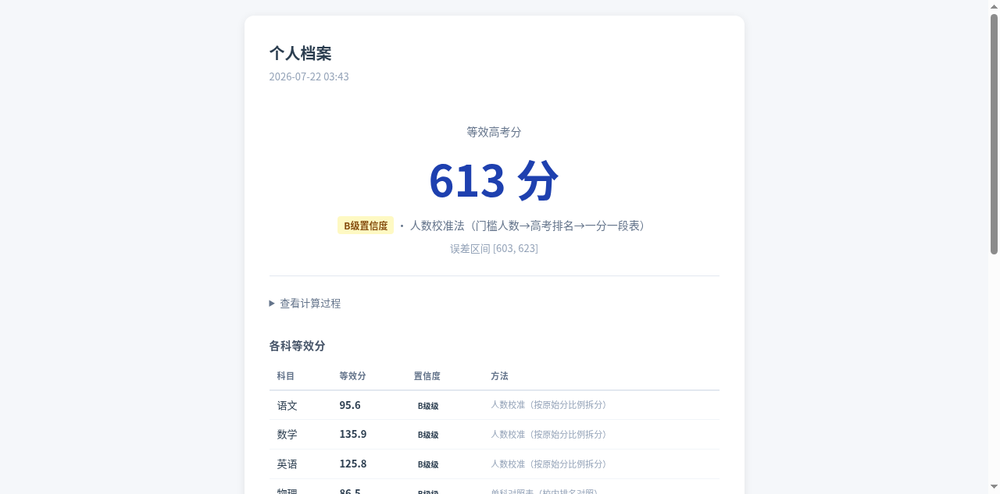
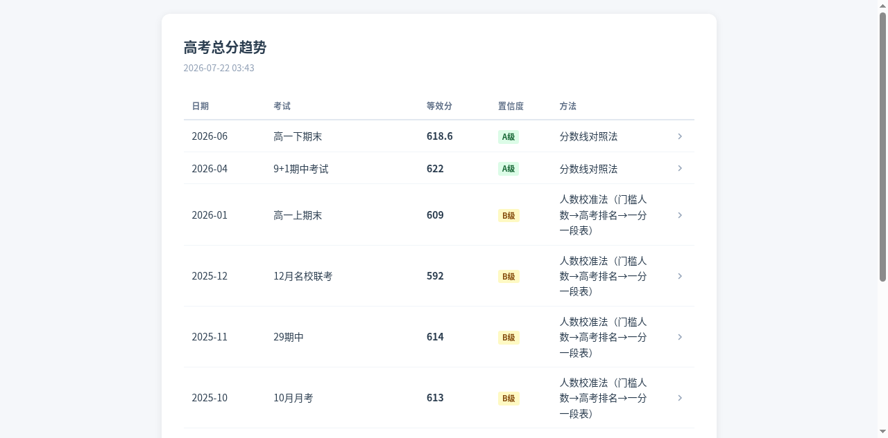

<div align="center">

# 学业追踪与等效分报告

**面向高中学生的学业数据整合工具**

追踪考试成绩 · 计算等效高考分 · 分析趋势波动 · 生成可视化报告

[](LICENSE)
[](https://www.python.org/)
[](https://github.com/maybe-qy/study-tracker)
[](https://github.com/maybe-qy/study-tracker/issues)
[](https://github.com/maybe-qy/study-tracker/pulls)

</div>

---

## 报告演示

<div align="center">

**个人档案报告** — 等效分、各科拆分、趋势状态、院校定位



**高考总分趋势报告** — 等效分时间序列、置信度颜色编码、波动分析



</div>

---

## 功能一览

| 功能 | 说明 |
|------|------|
| **成绩录入** | 逐字段录入考试科目成绩、排名、特控线，自动校验总分一致性 |
| **等效分计算** | 8 种方法按优先级自动选择，加权融合，标注置信度和误差区间 |
| **趋势分析** | 等效分时间序列追踪，EWMA 预测状态（积极/正常/消极），波动风格分类 |
| **单科追踪** | 语文/数学/英语/选科独立追踪，动态赋分计算 |
| **院校定位** | 目标院校差距分析，院校层次梯队定位 |
| **HTML 报告** | 8 份独立报告一键生成，按日期降序排列（最新在前） |

## 快速开始

### 安装

```bash
git clone https://github.com/maybe-qy/study-tracker.git
cd study-tracker
pip install -r requirements.txt
```

### 初始化工作区

```bash
python src/scripts/setup_workspace.py --workspace .
```

创建目录结构和带表头的 Excel 文件：

```
data/
├── macro/          # 宏观数据（一分一段表、特控线、赋分区间等）
├── school/         # 学校招生录取数据
└── personal/       # 个人数据（成绩总表、等效分记录、单科追踪）
    └── individual/ # 每次考试的 Markdown 不可变存档
```

### 录入第一次成绩

```bash
python src/scripts/record_exam.py << 'EOF'
{
  "workspace": ".",
  "exam_name": "10月月考",
  "exam_date": "2025-10-15",
  "exam_type": "月考",
  "grade": "高二",
  "total_score": 580,
  "cn_score": 105,
  "math_score": 110,
  "en_score": 115,
  "sub1_name": "物理", "sub1_raw": 78, "sub1_assigned": 85,
  "sub2_name": "化学", "sub2_raw": 72, "sub2_assigned": 88,
  "sub3_name": "生物", "sub3_raw": 68, "sub3_assigned": 82,
  "school_rank": 80,
  "school_total": 835
}
EOF
```

### 计算等效分

```bash
python src/scripts/calc_equivalent.py << 'EOF'
{
  "workspace": ".",
  "exam_name": "10月月考",
  "exam_date": "2025-10-15",
  "total_score": 580,
  "school_rank": 80,
  "school_total": 835
}
EOF
```

### 保存等效分

```bash
python src/scripts/save_equivalent.py \
  --workspace . \
  --exam-name "10月月考" \
  --exam-date "2025-10-15"
```

### 生成报告

```bash
python src/scripts/generate_reports.py --workspace .
```

生成 8 份 HTML 报告到 `output/` 目录：

| 报告 | 说明 |
|------|------|
| `个人档案.html` | 最新等效分、状态判断、院校定位 |
| `高考总分趋势.html` | 等效分时间序列、趋势方向、波动分析 |
| `语文追踪.html` | 语文单科历史和动态赋分 |
| `数学追踪.html` | 数学单科历史和动态赋分 |
| `英语追踪.html` | 英语单科历史和动态赋分 |
| `选科1追踪.html` | 选科1单科历史和动态赋分 |
| `选科2追踪.html` | 选科2单科历史和动态赋分 |
| `选科3追踪.html` | 选科3单科历史和动态赋分 |

## 等效分计算方法

按优先级自动选择第一个可用方法，所有可用方法按置信度加权融合。

| 优先级 | 方法 | 置信度 | 触发条件 |
|:------:|------|:------:|---------|
| 1 | 双模块换算法 | A/B | 校内各科特控线+浙大线数据 |
| 2 | 人数校准法 | B | 校内排名 + 门槛上线人数 + 一分一段表 |
| 3 | 分数线对照法 | A | 模考特控线 + 高考特控线 |
| 4 | 校排阈值估算法 | B | 校内特控线+浙大线阈值 |
| 5 | 校内排名对照法 | A | 本校高考对照表 + 校内排名 |
| 6 | 单科排名对照法 | A | 单科对照表 + 校内单科排名 |
| 7 | 排名锚定法 | A | 全市/联盟排名 + 一分一段表（交叉验证） |
| 8 | 校排名估算 | C | 仅校内排名 + 学校类型 |

**融合权重**：A=1.0, B=0.8, C=0.5, D=0（D 级不参与）

**人数校准法**（v3.2 新增）是本工具的核心创新：利用校内门槛上线人数与高考一分一段表的映射关系，将校内排名精确映射到高考排名。实测精度从 C 级的平均偏低 81 分提升到与 A 级仅差 5-10 分。

## 目录结构

```
study-tracker/
├── src/
│   ├── scripts/
│   │   ├── setup_workspace.py      # 工作区初始化
│   │   ├── record_exam.py          # 成绩录入
│   │   ├── calc_equivalent.py      # 等效分计算（8种方法）
│   │   ├── save_equivalent.py      # 等效分保存
│   │   └── generate_reports.py     # HTML报告生成
│   ├── assets/
│   │   ├── report_personal.html    # 个人档案模板
│   │   ├── report_trend.html       # 趋势报告模板
│   │   └── report_subject.html     # 单科追踪模板
│   ├── references/
│   │   ├── calculation_methods.md  # 计算方法公式
│   │   ├── data_schema.md          # 数据字段定义
│   │   ├── interaction_examples.md # 交互示例
│   │   └── interaction_scripts.md  # 边界案例
│   └── tests/                      # pytest 测试
├── data/                           # 数据目录（Git忽略）
├── output/                         # 报告输出（Git忽略）
├── requirements.txt
├── CHANGELOG.md
└── LICENSE
```

## 依赖

| 依赖 | 版本 | 用途 |
|------|------|------|
| Python | 3.9+ | 运行环境 |
| openpyxl | 3.1+ | Excel 读写 |
| Jinja2 | 3.1+ | HTML 模板渲染 |

## 权限与安全

- 所有计算在本地完成，**完全离线运行**，无网络请求
- 仅操作用户指定的 workspace 目录，不访问其他路径
- 不收集用户个人信息、浏览器缓存、SSH 密钥等
- 建议执行前审阅 Python 脚本源码

## Roadmap

- [x] 8 种等效分计算方法 + 加权融合
- [x] 人数校准法（B 级，填补 C 级精度缺口）
- [x] HTML 报告按日期降序排列（最新在前）
- [x] 趋势图区分不同置信度数据点
- [x] 单科排名对照法（A 级）
- [ ] 报告内嵌 ECharts 交互式图表
- [ ] 多省份宏观数据支持
- [ ] Web UI 界面

## FAQ

**Q: 等效分是预测高考分吗？**

不是。等效分是将校内考试分数换算到高考尺度上的参考值，帮助评估当前水平相对于高考分数线的大致位置。实际高考成绩受多种因素影响，等效分不构成预测。

**Q: 没有特控线的校考怎么计算？**

系统会自动降级到人数校准法（B 级）或校排名估算（C 级）。推荐补充门槛数据（特控线上线人数）以启用 B 级方法，精度远优于 C 级。

**Q: 支持哪些省份？**

当前适配浙江新高考（选考赋分制）。一分一段表和特控线数据需用户自行导入。其他省份可通过修改宏观数据适配。

**Q: 数据安全吗？**

全部数据存储在本地 Excel 文件中，不上传任何信息到外部服务器。`data/` 目录已在 `.gitignore` 中排除。

## 贡献

欢迎提交 Issue 和 PR：

- [报告问题](https://github.com/maybe-qy/study-tracker/issues)
- [提交 Pull Request](https://github.com/maybe-qy/study-tracker/pulls)

## 深入文档

| 文档 | 内容 |
|------|------|
| [SKILL.md](src/SKILL.md) | 完整 Skill 定义与交互流程 |
| [计算方法详解](src/references/calculation_methods.md) | 8 种方法公式与边界条件 |
| [数据字段定义](src/references/data_schema.md) | 全部 Excel/Markdown 字段说明 |
| [交互示例](src/references/interaction_examples.md) | 端到端对话示例 |
| [边界案例](src/references/interaction_scripts.md) | 8 种场景处理策略 |
| [变更记录](CHANGELOG.md) | 版本更新历史 |

## 开源协议

[MIT License](LICENSE) — 自由使用、修改、分发

---

<div align="center">

如果这个项目对你有帮助，欢迎 Star 支持

</div>
