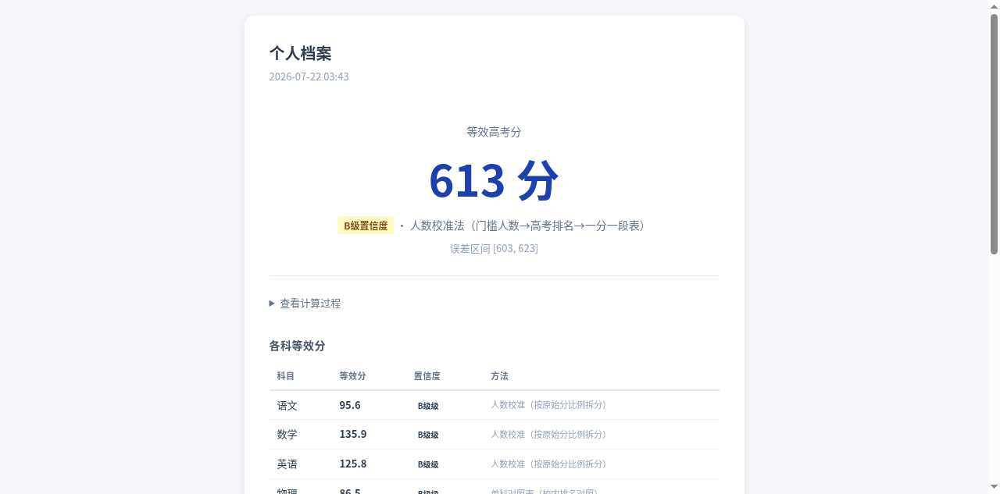
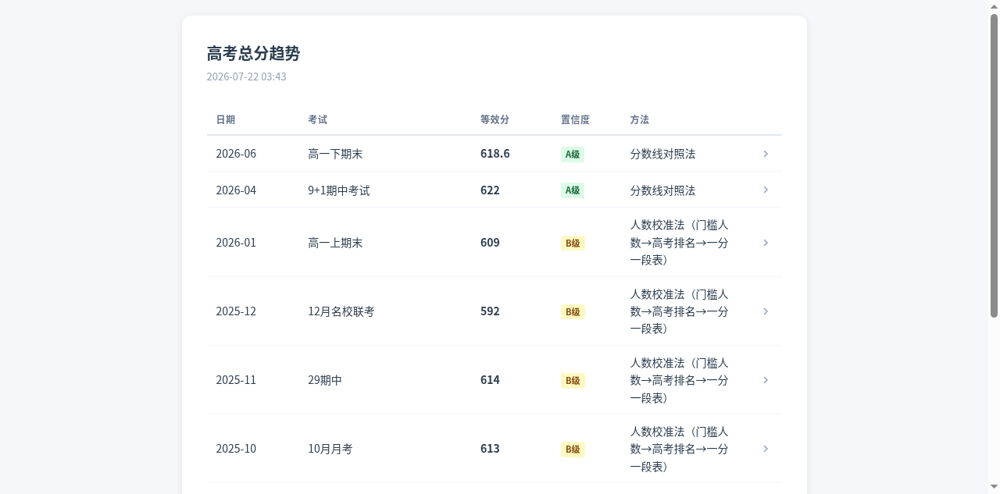

<div align="center">

# 学业追踪与等效分报告

**面向高中学生的学业数据整合工具**

追踪考试成绩 · 计算等效高考分 · 分析趋势波动 · 生成可视化报告

[](LICENSE)
[](https://www.python.org/)
[](https://github.com/maybe-qy/study-tracker)
[](https://github.com/maybe-qy/study-tracker/issues)
[](https://github.com/maybe-qy/study-tracker/pulls)

</div>

---

## 报告演示

<div align="center">

**个人档案报告** — 等效分、各科拆分、趋势状态、院校定位



**高考总分趋势报告** — 等效分时间序列、置信度颜色编码、波动分析



</div>

---

## 功能一览

| 功能 | 说明 |
|------|------|
| **成绩录入** | 逐字段录入考试科目成绩、排名、特控线，自动校验总分一致性 |
| **等效分计算** | 8 种方法按优先级自动选择，加权融合，标注置信度和误差区间 |
| **趋势分析** | 等效分时间序列追踪，EWMA 预测状态（积极/正常/消极），波动风格分类 |
| **单科追踪** | 语文/数学/英语/选科独立追踪，动态赋分计算 |
| **院校定位** | 目标院校差距分析，院校层次梯队定位 |
| **HTML 报告** | 8 份独立报告一键生成，按日期降序排列（最新在前） |

## 用 AI 助手开始（推荐）

把下面的内容发给你的 AI 助手（豆包、ChatGPT、Claude 等）：

> 帮我部署运行这个项目：https://github.com/maybe-qy/study-tracker
> 请先阅读 skill/QUICKSTART.md，然后帮我录入成绩。

AI 会自动完成部署、录入、计算、生成报告，全程对话操作，无需命令行。

---

## 命令行快速开始

### 安装

```bash
git clone https://github.com/maybe-qy/study-tracker.git
cd study-tracker
pip install -r requirements.txt
```

### 初始化工作区

```bash
python3 src/scripts/setup_workspace.py --workspace .
```

创建目录结构和带表头的 Excel 文件：

```
data/
├── macro/          # 宏观数据（一分一段表、特控线、赋分区间等）
├── school/         # 学校招生录取数据
└── personal/       # 个人数据（成绩总表、等效分记录、单科追踪）
    └── individual/ # 每次考试的 Markdown 不可变存档
```

### 录入第一次成绩

```bash
python3 src/scripts/record_exam.py << 'EOF'
{
  "workspace": ".",
  "exam_name": "10月月考",
  "exam_date": "2026-10-15",
  "exam_type": "月考",
  "grade": "高二",
  "total_score": 580,
  "cn_score": 105,
  "math_score": 110,
  "en_score": 115,
  "sub1_name": "物理", "sub1_raw": 78, "sub1_assigned": 85,
  "sub2_name": "化学", "sub2_raw": 72, "sub2_assigned": 88,
  "sub3_name": "生物", "sub3_raw": 68, "sub3_assigned": 82,
  "school_rank": 80,
  "school_total": 835
}
EOF
```

### 计算等效分

```bash
python3 src/scripts/calc_equivalent.py << 'EOF'
{
  "workspace": ".",
  "exam_name": "10月月考",
  "exam_date": "2026-10-15",
  "total_score": 580,
  "school_rank": 80,
  "school_total": 835,
  "special_line": 542.5,
  "subjects": [
    {"name": "语文", "raw": 105},
    {"name": "数学", "raw": 110},
    {"name": "英语", "raw": 115},
    {"name": "物理", "raw": 78, "assigned": 85},
    {"name": "化学", "raw": 72, "assigned": 88},
    {"name": "生物", "raw": 68, "assigned": 82}
  ]
}
EOF
```

### 保存等效分

将上一步的输出通过管道传给 `save_equivalent.py`：

```bash
python3 src/scripts/calc_equivalent.py < exam_data.json | python3 src/scripts/save_equivalent.py \
  --workspace . \
  --exam-name "10月月考" \
  --exam-date "2026-10-15"
```

### 生成报告

```bash
python3 src/scripts/generate_reports.py --workspace .
```

生成 HTML 报告到 `output/` 目录：

| 报告 | 说明 |
|------|------|
| `个人等效.html` | 最新等效分、状态判断、院校定位 |
| `高考总分趋势.html` | 等效分时间序列、趋势方向、波动分析 |
| `语文追踪.html` | 语文单科历史和动态赋分 |
| `数学追踪.html` | 数学单科历史和动态赋分 |
| `外语追踪.html` | 外语单科历史和动态赋分 |
| `物理追踪.html` 等 | 选科单科追踪（按实际选科命名） |

## 等效分计算方法

7 种有效方法按需自动选择，加权融合（A=1.0 / B=0.8）。v4.0 起 C 级方法弃用，仅 C 级时返回 insufficient_data。

- **A 级**（±5 分）：分数线对照法、校内排名对照法、单科排名对照法、排名锚定法
- **A/B 级**（±5-10 分）：双模块换算法
- **B 级**（±10 分）：人数校准法、校排阈值估算法

## 目录结构

```
study-tracker/
├── src/
│   ├── scripts/
│   │   ├── config.py               # 集中配置常量
│   │   ├── setup_workspace.py      # 工作区初始化
│   │   ├── record_exam.py          # 成绩录入
│   │   ├── calc_equivalent.py      # 等效分计算（7种方法）
│   │   ├── save_equivalent.py      # 等效分保存
│   │   ├── generate_reports.py     # HTML报告生成
│   │   └── excel_utils.py          # Excel读写工具函数
│   └── assets/
│       ├── logos/                  # 大学校徽SVG（~95所）
│       ├── report_personal.html    # 个人档案模板
│       ├── report_trend.html       # 趋势报告模板
│       └── report_subject.html     # 单科追踪模板
├── skill/
│   ├── SKILL.md                    # 完整 Skill 定义
│   ├── QUICKSTART.md               # AI 助手快速指南
│   └── references/                 # 参考文档
├── tests/                          # pytest 测试
├── docs/                           # 项目介绍与竞品分析
├── data/                           # 数据目录
├── output/                         # 报告输出（Git忽略）
├── 原则/                           # 红线与原则文档
├── 推广/                           # 推广文案
├── requirements.txt
├── requirements-dev.txt
├── pyproject.toml
├── CHANGELOG.md
└── LICENSE
```

## 依赖

| 依赖 | 版本 | 用途 |
|------|------|------|
| Python | 3.9+ | 运行环境 |
| openpyxl | 3.1+ | Excel 读写 |
| Jinja2 | 3.1+ | HTML 模板渲染 |

## 权限与安全

- 所有计算在本地完成，**完全离线运行**，无网络请求
- 仅操作用户指定的 workspace 目录，不访问其他路径
- 不收集用户个人信息、浏览器缓存、SSH 密钥等
- 建议执行前审阅 Python 脚本源码

## Roadmap

- [x] 8 种等效分计算方法 + 加权融合
- [x] 人数校准法（B 级，填补 C 级精度缺口）
- [x] HTML 报告按日期降序排列（最新在前）
- [x] 趋势图区分不同置信度数据点
- [x] 单科排名对照法（A 级）

## FAQ

**Q: 等效分是预测高考分吗？**

不是。等效分是将校内考试分数换算到高考尺度上的参考值，帮助评估当前水平相对于高考分数线的大致位置。实际高考成绩受多种因素影响，等效分不构成预测。

**Q: 没有特控线的校考怎么计算？**

系统会自动降级到人数校准法（B 级）或校排名估算（C 级）。推荐补充门槛数据（特控线上线人数）以启用 B 级方法，精度远优于 C 级。

**Q: 支持哪些省份？**

当前适配浙江新高考（选考赋分制）。一分一段表和特控线数据需用户自行导入。其他省份可通过修改宏观数据适配。

**Q: 数据安全吗？**

全部数据存储在本地 Excel 文件中，不上传任何信息到外部服务器。`data/personal/` 目录已在 `.gitignore` 中排除。

## 贡献

欢迎提交 Issue 和 PR：

- [报告问题](https://github.com/maybe-qy/study-tracker/issues)
- [提交 Pull Request](https://github.com/maybe-qy/study-tracker/pulls)

## 深入文档

| 文档 | 内容 |
|------|------|
| [SKILL.md](skill/SKILL.md) | 完整 Skill 定义与交互流程 |
| [计算方法详解](skill/references/calculation_methods.md) | 8 种方法公式与边界条件 |
| [数据字段定义](skill/references/data_schema.md) | 全部 Excel/Markdown 字段说明 |
| [交互示例](skill/references/interaction_examples.md) | 端到端对话示例 |
| [边界案例](skill/references/interaction_scripts.md) | 8 种场景处理策略 |
| [变更记录](CHANGELOG.md) | 版本更新历史 |

## 开源协议

[MIT License](LICENSE) — 自由使用、修改、分发

---

<div align="center">

如果这个项目对你有帮助，欢迎 Star 支持

</div>
